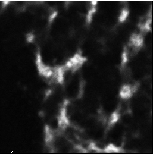
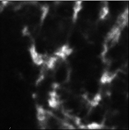
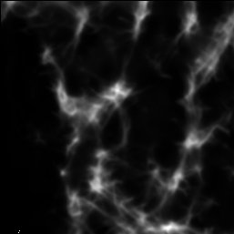
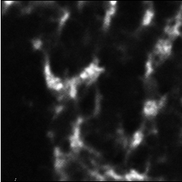
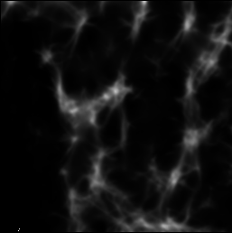
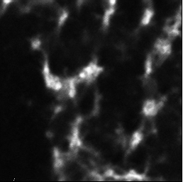
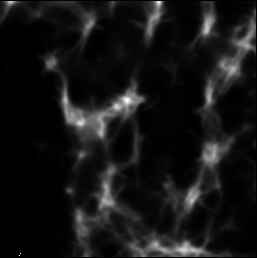
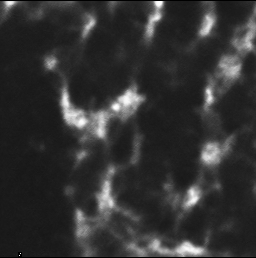
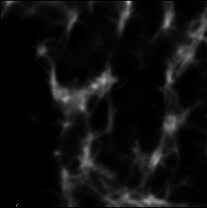

# Inference code for flybrain image enhancement

## Easy startup
    pip install requirements.txt

## Experiment

| **Experiment** | **augmentation** | **inference datatype** | **saved datatype** | **cost time per 32x256x256 patch** |                  **enhanced img**                  |                    **enhanced seg**                    |
|:--------------:|:----------------:|:----------------------:|:------------------:|:----------------------------------:|:--------------------------------------------------:|:------------------------------------------------------:|
|       A        |  enconde+decode  |          fp32          |        fp32        |              4.084 s               |  |  |
|       B        |      decode      |          fp32          |        fp32        |               3.18 s               |  |  |
|       C        |  encode+decode   |          fp16          |        fp32        |              3.146 s               |  |  |
|       D        |      decode      |          fp16          |        fp32        |               2.43 s               |                                                    |                                                        |
|       E        |  enconde+decode  |          fp32          |       uint16       |              4.084 s               |  |  |
|       F        |  enconde+decode  |          fp32          |       uint8        |              4.084 s               |   |   |

## Pipeline 

<code><b> click here </b></code>

    -  Initial tester object    
        tester = MicroTest()
    -  Register data
        x0 = tester.get_data()
    -  Register model
        tester.update_model()
    -  Testing
        1. Test single image
        2. Tesing multiple patch
        3. Assemble patch to large image

## Arguments flag

<code><b> click here </b></code>

    --fp16: use float point 16 inference model 
    --assemble_method: compose image method, can use tiff or zarr
    --save: which images you want to save, ex: ori seg, can use ori seg recon xy
    --image_datatype: saved image datatype, support float32, uint16, uint8
    --augmentation: do augmentation while encode or decode, will be more faster if do --augmentation decode
    --roi: assigned subfolder naming, ex: roiA

## Support data types

<code><b> click here </b></code>

    - Support load data 2D/3D tif and numpy latent Z
        - 2D folder : Use argument image_list_path in config yaml
        - 3D staack : Use argument image_path in config yaml
        - latent Z : Use argument hbranch_path in config yaml
More details in function ****"get_data"****

## Images enhancement

<code><b> click here </b></code>

    - Test single image
        - Encoder + Decoder : Call "test_model" ex: tester.test_model(x0, [None, 'transpose', 'flipX', 'flipY'])
        - Encode : Call "test_ae_encode" ex: reconstructions, ori, hbranch = tester.test_ae_encode(x0)
        - latent Z : Call "test_ae_decode" ex: out_all, out_seg_all = self.test_ae_decode(hbranch_data, input_augmentation)
    - Test multiple images
        - Call tester.test_assemble(x0, mode)
        - Encoder + Decoder : mode="full"
        - Encode : mode="encode"
        - latent Z : mode="decode"

## Assemble images

<code><b> click here </b></code>

    - Assemble patch to large images
    Ex : tester.show_or_save_assemble_microscopy(zrange=zrange, xrange=xrange, yrange=yrange,
                                            source=os.path.join(tester.config['DESTINATION'], tester.kwargs["dataset"], 'cycout/xy/'),
                                            output_path="xy_slice_folder"
                                            )
        - Note that: if using tiff method, output_path should br a folder

## Example usage

<code><b> click here </b></code>

    
    CUDA_VISIBLE_DEVICES=3 python test_combine_o.py --prj /1dpm/ --epoch 1100 --model_type AE --gpu --hbranchz --assemble --assemble_method tiff --config config_122924 --save ori seg

